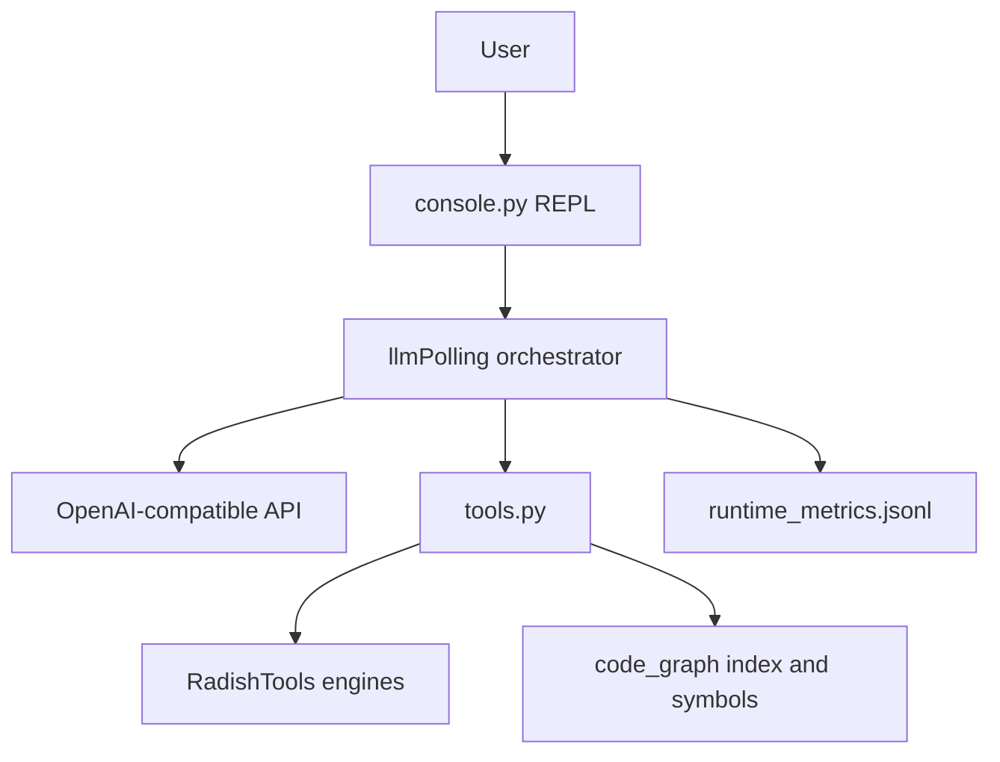

# Radish-Agent

A **local AI coding agent REPL** focused on **symbol-level code understanding**, a **governed tool chain**, and **OpenAI-compatible multi-provider** setups.

**中文:** [README.md](README.md)

---

## Highlights

| Feature | Description |
|---------|-------------|
| **Three REPL modes** | `ask` (read-only), `plan` (read-only planning), `agent` (can modify code); switch via `/mode` or use `auto` |
| **Project code graph** | `search_symbols` / `read_symbol` / `write_symbol`; `/graph build` writes `CODE_GRAPH.json` |
| **write_file v2** | Primary `edits(JSON)` protocol with `dry_run`, conflict detection, structured errors |
| **Tool-chain governance** | grep batching, loop guards, native tool-message repair for stabler investigations |
| **Multi-provider** | `config.yaml` + `/setup` / `/switch`; optional models.dev context cache |
| **Observability** | `runtime_metrics.jsonl`; `/usage on` shows tokens and **prompt cache hit rate** |
| **Prompt prefix cache** | Static policy in one `system`, short `[Task]` user; typical **85–96%** hit on multi-tool turns (see benchmarks) |

---

## Architecture



---

## Comparison

| Capability | Radish-Agent | IDE built-in Chat | DIY API scripts |
|------------|:------------:|:-----------------:|:---------------:|
| Symbol-level read/write (neighbors, callers) | Yes (code graph) | Vendor-dependent | Build yourself |
| Structured writes (edits + conflicts) | write_file v2 | Varies | Build yourself |
| Tool-loop / investigation guards | Orchestrator policies | Opaque | Build yourself |
| Local multi-provider config | config.yaml | Often locked | Possible |
| Local metrics + regression CLI | metrics + test_flow_cli | Weak/none | Build yourself |
| Fully local controllable REPL | Yes | No | Partial |

---

## Quick start

```bash
cd Radish-Agent
python -m venv .venv
source .venv/bin/activate   # Windows: .venv\Scripts\activate
pip install -r requirements.txt
# optional: pip install -r requirements-code-graph.txt

python llmServer/console.py
```

Configure providers with `/setup` or edit `config.yaml` (gitignored).

Slash commands: `/help`, `/mode agent`, `/graph build`, `/clear`, `/exit`. Type `/` for completion (requires `prompt-toolkit`).

---

## Console commands (short)

| Command | Purpose |
|---------|---------|
| `/help` | Show help |
| `/mode ask\|plan\|agent\|auto` | Switch mode |
| `/graph build` | Build code graph for cwd |
| `/graph status` | Graph status |
| `/budget` | Tool call budget |
| `/setup` / `/switch` | Provider wizard / switch model |
| `/clear` | Clear session |
| `/usage on\|off` | Token usage and per-round cache hit rate |
| `/allow config` | Allow reading config.yaml this session |

---

## Prompt cache hit rate

Providers such as **DeepSeek** cache identical **message prefixes** (from token 0). Radish keeps static instructions in a single frozen `system`, uses short `[Task]` user messages, and defers context compression until a turn ends. Hit rate is read from API `usage` (`prompt_cache_hit_tokens` or `prompt_tokens_details.cached_tokens`).

### How to view

```
/usage on
```

- **Prompt**: `(agent-[12.5k|85%cache])` — session tokens + last-round hit rate  
- **During tool rounds**: `[usage] round=N … hit=…%`  
- **After reply**: per-round summary for that `sendinfo`  
- **File**: `runtime_metrics.jsonl` includes `cached_tokens`, `cache_hit_rate`

### Verification (needs `config.yaml` + API)

```bash
python tests/integration/verify_prompt_cache_usage.py
```

### Measured results (DeepSeek `deepseek-v4-flash`, May 2026)

**Integration probe** (fixed long system, two calls):

| Case | prompt | cached | hit rate |
|------|--------|--------|----------|
| Direct API round 1 | 777 | 0 | 0% (cold) |
| Direct API round 2 | 777 | 768 | **98.8%** |
| `Polling.sendinfo` turn 1 | 3949 | 0 | 0% |
| `Polling.sendinfo` turn 2 | 4442 | 3840 | **86.5%** |

**Graph tool chain #1** (one `sendinfo`, 4 tool API rounds):

| API round | prompt | cached | hit rate |
|-----------|--------|--------|----------|
| 1 | 4071 | 3456 | 84.9% |
| 2 | 5598 | 3968 | 70.9% |
| 3 | 6489 | 5632 | 86.8% |
| 4 | 9875 | 6784 | 68.7% |

Weighted hit ≈ **76%** for that turn.

**Graph tool chain #2** (continued session, 5 tool API rounds; includes `CreateProjectWikiExecutor.execute`, etc.):

| API round | prompt | cached | hit rate |
|-----------|--------|--------|----------|
| 1 | 10719 | 10240 | **95.5%** |
| 2 | 12575 | 10880 | 86.5% |
| 3 | 14815 | 12672 | 85.5% |
| 4 | 20082 | 15104 | 75.2% |
| 5 | 20797 | 20096 | **96.6%** |

Weighted hit ≈ **87%** for that turn (~107k session tokens). Round 4 dips after large `read_symbol` tool payloads; round 5 recovers once the prefix stabilizes.

### Sliding window and sudden hit-rate drops (mitigated)

This is **not** chunk-based multi-request prompting. Each API call sends `system` + the **tail of `context`** (default last 40 messages). In very long sessions, if that tail **shifts** between tool rounds inside one `sendinfo`, the provider prefix no longer matches and hit rate can fall to ~13% (only `system` cached).

**In-turn freeze (default):** at `sendinfo` start, `_turn_slice_start_idx` is fixed; tool rounds only append to the tail until `_finalize_turn_context` runs sliding compression.

| Tip | Why |
|-----|-----|
| `/clear` before benchmarks | Avoid stacking many tests in one huge `context` |
| Raise `history_limit` in `config.yaml` | Long investigations |
| `CONTEXT_SUMMARY_MODE` | `heuristic` (default) or `llm` (summarize at turn boundary) |

> **Note:** “100% hit” on `search_symbols` / `read_symbol` in model replies means **CODE_GRAPH** returned symbols, not LLM prompt cache.

---

## write_file example

```python
write_file(
    "./main.py",
    edits=[{"op": "replace", "s": 3, "e": 4, "t": "for i in range(5):\n    print(i)"}],
)
```

---

## Testing

```bash
# Unit tests (no API)
python -m unittest discover -s llmServer -p "test_*.py"

# Integration (no API)
python tests/integration/verify_console_graph.py
python tests/integration/verify_config_audit.py

# Prompt cache check (needs API)
python tests/integration/verify_prompt_cache_usage.py

# LLM regression (needs config.yaml)
python llmServer/test_flow_cli.py run --group smoke
python llmServer/test_flow_cli.py run --group regression
python llmServer/test_flow_cli.py run --group destructive
```

Metrics helper: `python scripts/ab_metrics_report.py`

---

## Docs

- [CLAUDE.md](CLAUDE.md) — developer reference  
- [docs/](docs/) — design notes (tool chain, write engine, token optimization)

---

## Project layout

```
Radish-Agent/
├── llmServer/       # app entry, orchestration, tools, code_graph
├── RadishTools/     # file/shell execution
├── tests/           # fixtures + integration checks
├── scripts/         # dev utilities
└── docs/
```

---

## Status

Active development. Without `/graph build`, the agent falls back to `read_file` / `write_file`. Sensitive paths like `config.yaml` are blocked from `read_file` unless `/allow config` is used.
