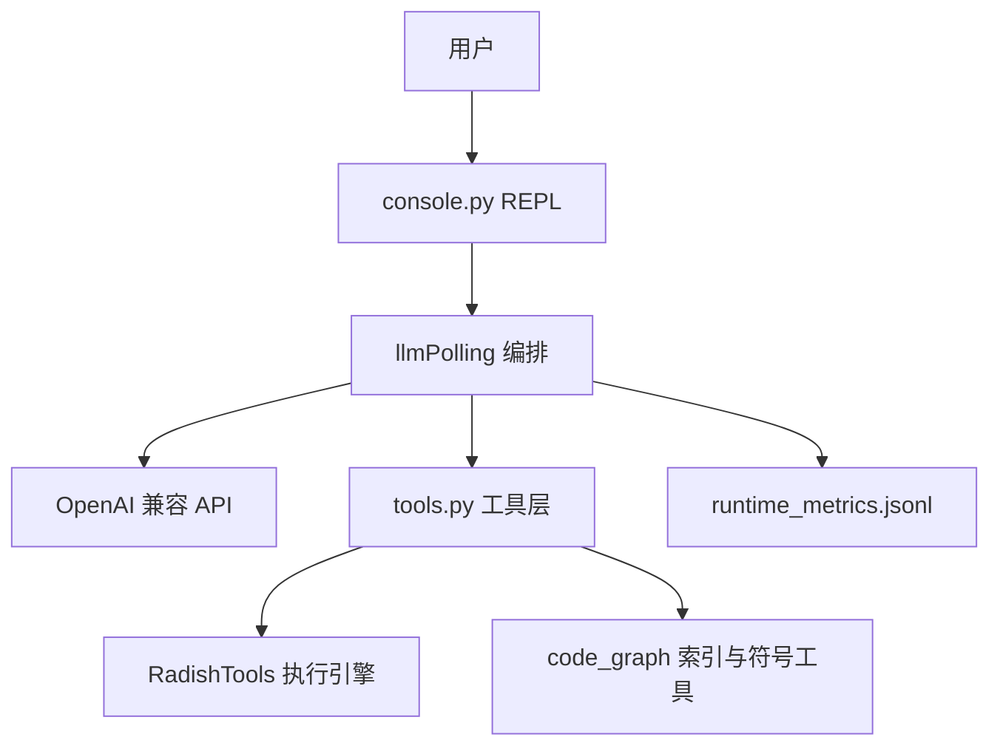

# Radish-Agent

本地运行的 AI 编码 Agent REPL：以**符号级代码图**理解项目，以**可控工具链**执行读写与调查，并支持**任意 OpenAI 兼容模型**。

**English:** [README.en.md](README.en.md)

---

## 核心亮点

| 能力 | 说明 |
|------|------|
| **三模式 REPL** | `ask`（只读）、`plan`（只读规划）、`agent`（可改代码）；`/mode` 切换或 `auto` 自动识别 |
| **项目代码图** | `search_symbols` / `read_symbol` / `write_symbol`；`/graph build` 生成 `CODE_GRAPH.json` |
| **write_file v2** | 以 `edits(JSON)` 为主协议，支持 `dry_run`、冲突检测、结构化错误与重试提示 |
| **工具链治理** | grep 批处理、防循环、native tool 消息链修复，调查类任务更稳、更少打满轮次 |
| **多提供商** | `config.yaml` + `/setup` / `/switch`，兼容 models.dev 上下文窗口缓存 |
| **可观测** | `runtime_metrics.jsonl` 记录 token/工具轮次；`/usage on` 显示用量与 **prompt cache 命中率** |
| **Prompt 前缀缓存** | 静态指令仅进 system、短 `[Task]` user、工具轮内不压缩摘要；多轮 tool 典型 **85–96%** 命中（见下文实测） |

---

## 架构



- **Console**：交互入口、`/` 命令补全、代码图状态展示  
- **Polling**：多轮对话、工具预算、循环防护、上下文压缩  
- **RadishTools**：`cmd` / `read_file` / `write_file` / `list_dir` 等实际 I/O  
- **code_graph**：多语言索引（AST/正则，可选 tree-sitter）、符号门禁  

---

## 与常见方案对比

| 能力 | Radish-Agent | IDE 内置 Chat | 自写脚本调 API |
|------|:------------:|:-------------:|:--------------:|
| 符号级读/改（邻居、调用方） | 有（代码图） | 依赖厂商 | 需自建 |
| 结构化写入（edits + 冲突） | write_file v2 | 因产品而异 | 需自建 |
| 工具循环 / 调查防刷 | 编排层策略 | 黑盒 | 需自建 |
| 多提供商本地配置 | config.yaml | 通常绑定厂商 | 可行 |
| 本地指标与回归 CLI | metrics + test_flow_cli | 弱/无 | 需自建 |
| 本地 REPL 全流程可控 | 是 | 否 | 部分 |

---

## 快速开始

### 环境（Windows cmd 示例）

```bat
cd Radish-Agent
python -m venv .venv
.venv\Scripts\activate
pip install -r requirements.txt
```

可选代码图 tree-sitter 后端：

```bat
pip install -r requirements-code-graph.txt
```

### 配置模型

复制并编辑 `config.yaml`（仓库默认 gitignore），或使用首次启动后：

```
/setup
```

### 启动控制台

```bat
python llmServer\console.py
```

常用命令：`/help`、`/mode agent`、`/graph build`、`/clear`、`/exit`。输入 `/` 可触发命令补全（需 `prompt-toolkit`）。

---

## Console 命令速查

| 命令 | 作用 |
|------|------|
| `/help` | 显示帮助 |
| `/mode ask\|plan\|agent\|auto` | 切换任务模式 |
| `/graph build` | 为当前目录构建代码图 |
| `/graph status` | 查看代码图状态 |
| `/budget` | 查看/设置工具调用预算 |
| `/setup` | 配置 LLM 提供商 |
| `/switch` | 切换已配置模型 |
| `/clear` | 清空会话 |
| `/debug on\|off` | 调试输出 |
| `/usage on\|off` | 显示 token 用量与各 API 轮次的 cache 命中率 |
| `/allow config` | 允许本会话读取 config.yaml（审计） |

---

## Prompt 缓存命中率

Provider（如 **DeepSeek**）按 **messages 前缀字节**做磁盘缓存；Radish 将静态策略冻结在单条 `system`，用户任务用短 `[Task]`，摘要仅在轮次间隙更新，以拉长可复用前缀。命中率从 API `usage` 解析（`prompt_cache_hit_tokens` 或 `prompt_tokens_details.cached_tokens`）。

### 如何查看

```
/usage on
```

- **提示符**：`(agent-[12.5k|85%cache])` — 会话累计 token + 最近一轮命中率  
- **工具轮进行中**：`[usage] round=N prompt=… cached=… hit=…%`  
- **回复结束后**：本轮各 API 轮次汇总  
- **指标文件**：`runtime_metrics.jsonl` 含 `cached_tokens`、`cache_hit_rate`

### 验收命令（需 `config.yaml` 与可用 API）

```bat
python tests\integration\verify_prompt_cache_usage.py
```

### 实测数据（DeepSeek `deepseek-v4-flash`，2026-05）

**集成探针**（固定长 system + 连续两轮）：

| 场景 | prompt tokens | cached | 命中率 |
|------|---------------|--------|--------|
| 直连 API 第 1 轮 | 777 | 0 | 0%（冷启动） |
| 直连 API 第 2 轮 | 777 | 768 | **98.8%** |
| `Polling.sendinfo` 第 1 句 | 3949 | 0 | 0% |
| `Polling.sendinfo` 第 2 句 | 4442 | 3840 | **86.5%** |

**Graph 工具链 #1**（单次 `sendinfo`，4 轮 tool：`search_symbols` + `read_symbol`）：

| API 轮次 | prompt | cached | 命中率 |
|---------|--------|--------|--------|
| 1 | 4071 | 3456 | 84.9% |
| 2 | 5598 | 3968 | 70.9% |
| 3 | 6489 | 5632 | 86.8% |
| 4 | 9875 | 6784 | 68.7% |

本轮加权约 **76%**（26033 prompt 累计）。

**Graph 工具链 #2**（同会话续测，5 轮 tool；含 `CreateProjectWikiExecutor.execute` 等）：

| API 轮次 | prompt | cached | 命中率 |
|---------|--------|--------|--------|
| 1 | 10719 | 10240 | **95.5%** |
| 2 | 12575 | 10880 | 86.5% |
| 3 | 14815 | 12672 | 85.5% |
| 4 | 20082 | 15104 | 75.2% |
| 5 | 20797 | 20096 | **96.6%** |

本轮加权约 **87%**（78988 prompt 累计）；会话累计约 107k tokens。第 4 轮在批量 `read_symbol` 后 context 膨胀，命中率短暂下探；第 5 轮前缀稳定后回升至 96%+。

### 滑动窗口与命中率骤降（已优化）

**不是**把 prompt 切成 chunk 分次请求，而是每次 API 发送 `system` + `context` **尾部最多 `history_limit×2` 条消息**（默认 40 条）。会话极长时，若轮内窗口随新 tool 结果**右移**，provider 前缀对齐失败，会出现仅 **system** 命中（约 3k cached、命中率 ~13%）。

**轮内冻结（默认开启）**：`sendinfo` 开始时固定 `_turn_slice_start_idx`，同一轮多次 tool API 只从该起点向后增长，不再丢弃 slice 头部；轮次结束后 `_finalize_turn_context` 再滑动并压缩。

| 建议 | 说明 |
|------|------|
| benchmark 前 `/clear` | 避免三轮测试叠在同一超长 `context` |
| `history_limit` | 可在 `config.yaml` 调大（调查类任务） |
| `CONTEXT_SUMMARY_MODE` | `heuristic`（默认，零成本）或 `llm`（轮次边界 LLM 摘要） |

> **注意**：模型回复里的「`search_symbols` / `read_symbol` 命中率 100%」指 **CODE_GRAPH 索引**是否返回符号结果，与上表 **LLM prompt cache** 是两套机制。

---

## write_file 示例

```python
write_file(
    "./main.py",
    edits=[{"op": "replace", "s": 3, "e": 4, "t": "for i in range(5):\n    print(i)"}],
)
```

典型错误返回含 `error_code`、`retryable`、`suggested_action`，便于模型自恢复。

---

## 测试与质量

推荐顺序：

```bat
REM 1) 单元测试（无需 API）
python -m unittest discover -s llmServer -p "test_*.py"

REM 2) 集成验收（无需 API）
python tests\integration\verify_console_graph.py
python tests\integration\verify_config_audit.py

REM 3) Prompt cache 验收（需 API，见上文）
python tests\integration\verify_prompt_cache_usage.py

REM 4) LLM 回归（需 config.yaml）
python llmServer\test_flow_cli.py list-cases
python llmServer\test_flow_cli.py run --group smoke
python llmServer\test_flow_cli.py run --group regression
python llmServer\test_flow_cli.py run --group destructive
```

写入引擎 pytest：

```bat
cd RadishTools\src\FileExecutor\core
python -m pytest test_write_file_v2.py -v
```

开发工具：分析指标 `python scripts\ab_metrics_report.py`

---

## 文档

| 文档 | 内容 |
|------|------|
| [CLAUDE.md](CLAUDE.md) | 开发者命令、架构与配置说明 |
| [docs/tools-chain-fix-summary.md](docs/tools-chain-fix-summary.md) | 工具链优化记录 |
| [docs/write_component_improvement.md](docs/write_component_improvement.md) | 写入组件设计 |
| [docs/min-output-optimization.md](docs/min-output-optimization.md) | 输出/token 优化 |

---

## 目录结构

```
Radish-Agent/
├── llmServer/           # 应用：console、编排、工具、代码图
├── RadishTools/         # 文件/命令执行引擎
├── tests/
│   ├── fixtures/        # 代码图迷你样例
│   └── integration/     # 无 API 集成验收
├── scripts/             # 开发脚本（如 metrics 分析）
├── docs/
├── requirements.txt
└── radish.sh            # Linux/Mac 启动脚本
```

---

## 状态说明

项目持续迭代中。代码图在未执行 `/graph build` 时自动降级为 `read_file` + `write_file`；敏感文件（如 `config.yaml`）默认禁止 `read_file`，可用 `/allow config` 临时放开。
